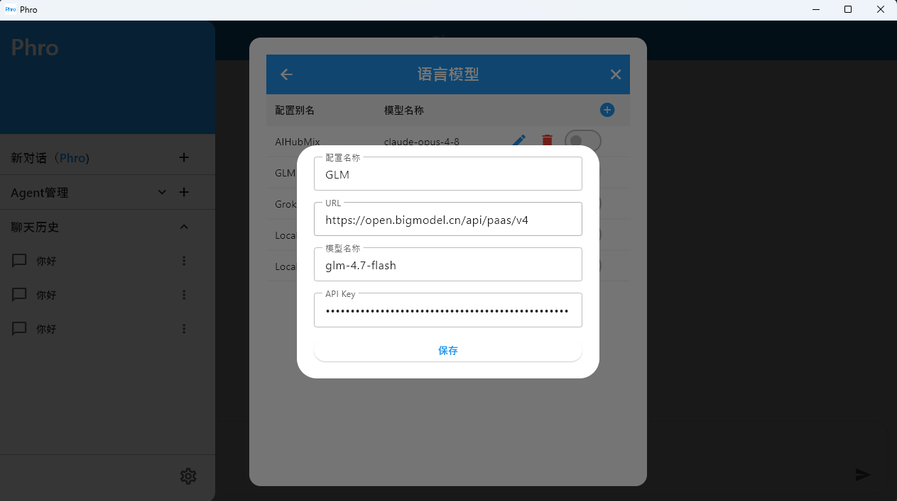

# Phro

## Phro 的目标是成为一个 <span style="color:#2196F3"><strong>强大</strong></span> & <span style="color:#2196F3"><strong>易用</strong></span> 的Agent助手。

项目使用 Flutter 开发，主要是为了更方便地覆盖桌面端、移动端与 Web 等多平台场景。


## 规划与进展

| 状态 | 能力                                                |
| ---- | --------------------------------------------------- |
| ✅    | Agent Loop与常见工具(本地文件修改、shell命令执行等) |
| ✅    | Human-in-the-loop                                   |
| ✅    | 自定义 Agent                                        |
| ✅    | 本地文件增删改查                                    |
| ✅    | 联网搜索                                            |
| ❌    | 多 Agent 协作与规划执行                             |
| ❌    | Office 文件处理                                     |
| ❌    | 移动设备自动化控制                                  |
| ❌    | 浏览器自动化控制                                    |
| ❌    | 多模态                                              |

## 使用指导

首次使用前，在设置中添加并启用语言模型配置：



如需联网搜索能力，也可以配置搜索 API。推荐Tavily、FireCrawl，每月有免费额度。

## 开发配置

需要先安装 Flutter 环境，具体可以参考 [Flutter 官方安装文档](https://docs.flutter.dev/install)。

```bash
flutter pub get
flutter run
```


## License

Apache-2.0
