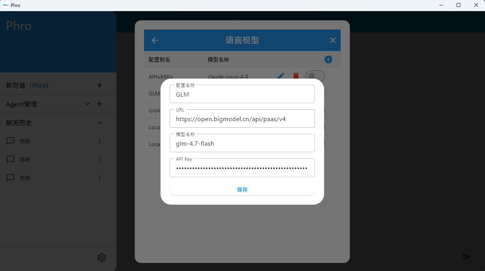

  

[English](README.md) | 简体中文

## Phro 是一个 <strong>强大</strong> & <strong>易用</strong> 的Agent助手。

## 项目特色
### 1. 安装即用！无需复杂的环境配置！
### 2. Windows、Android平台支持
### 3. 擅长类Claude Code、Codex的本地编码
### 4. 擅长联网搜索与问答
其余特长待发掘

## 快速开始

### 语言模型必须配：

免费模型推荐智谱的[glm-4.7-flash](https://bigmodel.cn/)。  
各大平台都有免费模型/注册薅羊毛，不一一列举

### 如需联网搜索能力，需配置搜索 API。
目前支持[Tavily](https://www.tavily.com/)、[FireCrawl](https://www.firecrawl.dev/)，每月有免费额度。  

## 用户支持
联系微信xdu11117  
或邮箱2321409910@qq.com

## License

Apache-2.0
   